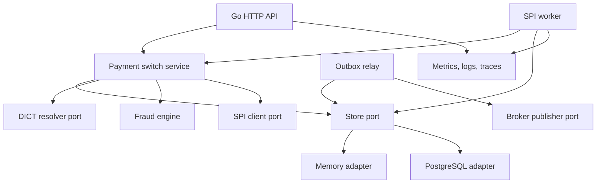

# C4 Container

The API, SPI worker, and relay share the same switch/store contracts. The Compose runtime starts the API and SPI worker as separate processes; a broker-backed relay remains an adapter milestone because no external broker is required for the local challenge runtime.
