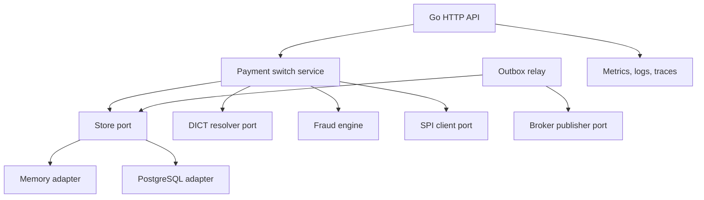

# C4 Container

```mermaid
flowchart TB
  API["Go HTTP API"] --> Switch["Payment switch service"]
  Switch --> Store["Store port"]
  Store --> Memory["Memory adapter"]
  Store --> Postgres["PostgreSQL adapter"]
  Switch --> Dict["DICT resolver port"]
  Switch --> Fraud["Fraud engine"]
  Switch --> SPI["SPI client port"]
  Relay["Outbox relay"] --> Store
  Relay --> Broker["Broker publisher port"]
  API --> Obs["Metrics, logs, traces"]
```

The API and relay can be deployed as one process for the portfolio MVP. In production, the relay can run as a separate worker using the same store and publisher contracts.
