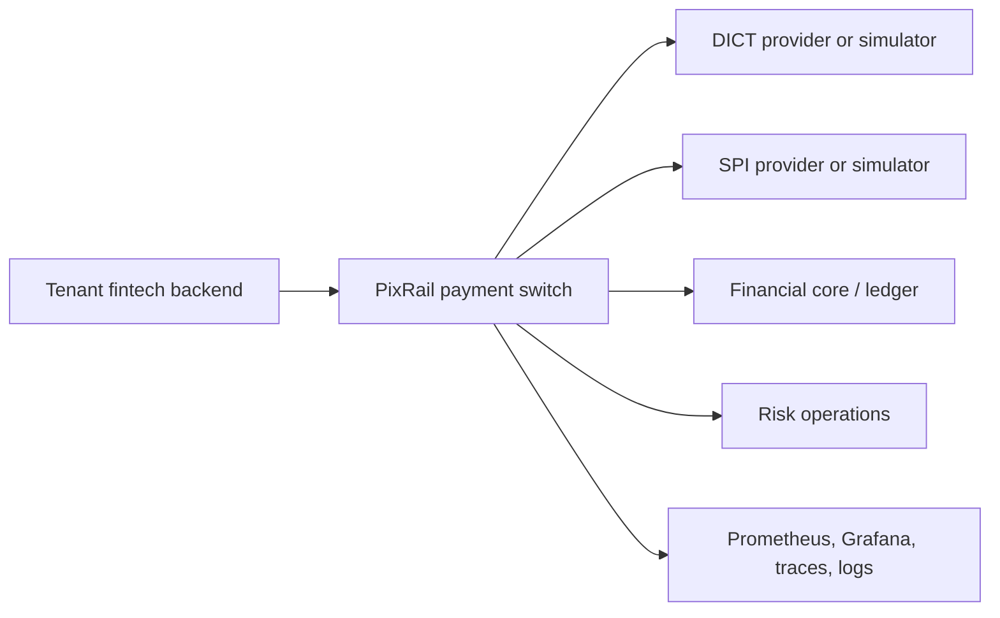

# C4 Context

```mermaid
flowchart LR
  Tenant["Tenant fintech backend"] --> PixRail["PixRail payment switch"]
  PixRail --> Dict["DICT provider or simulator"]
  PixRail --> SPI["SPI provider or simulator"]
  PixRail --> Core["Financial core / ledger"]
  PixRail --> Risk["Risk operations"]
  PixRail --> Obs["Prometheus, Grafana, traces, logs"]
```

PixRail is the payment-rail boundary. It emits events to financial systems but does not own balances.
