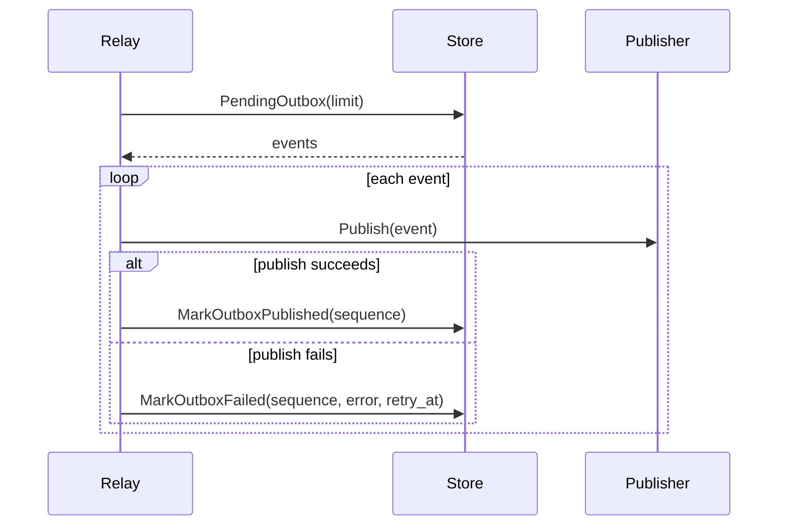

# Sequence Diagrams

## Transfer creation

See [docs/diagrams/transfer-sequence.md](../diagrams/transfer-sequence.md).

## Outbox relay

```mermaid
sequenceDiagram
  participant R as Relay
  participant S as Store
  participant P as Publisher
  R->>S: PendingOutbox(limit)
  S-->>R: events
  loop each event
    R->>P: Publish(event)
    alt publish succeeds
      R->>S: MarkOutboxPublished(sequence)
    else publish fails
      R->>S: MarkOutboxFailed(sequence, error, retry_at)
    end
  end
```
