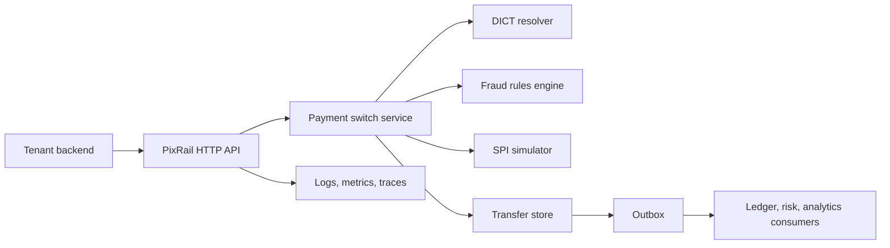

# System Context

```mermaid
flowchart LR
  Tenant["Tenant backend"] --> API["PixRail HTTP API"]
  API --> Switch["Payment switch service"]
  Switch --> Dict["DICT resolver"]
  Switch --> Fraud["Fraud rules engine"]
  Switch --> SPI["SPI simulator"]
  Switch --> Store["Transfer store"]
  Store --> Outbox["Outbox"]
  Outbox --> Consumers["Ledger, risk, analytics consumers"]
  API --> Obs["Logs, metrics, traces"]
```
