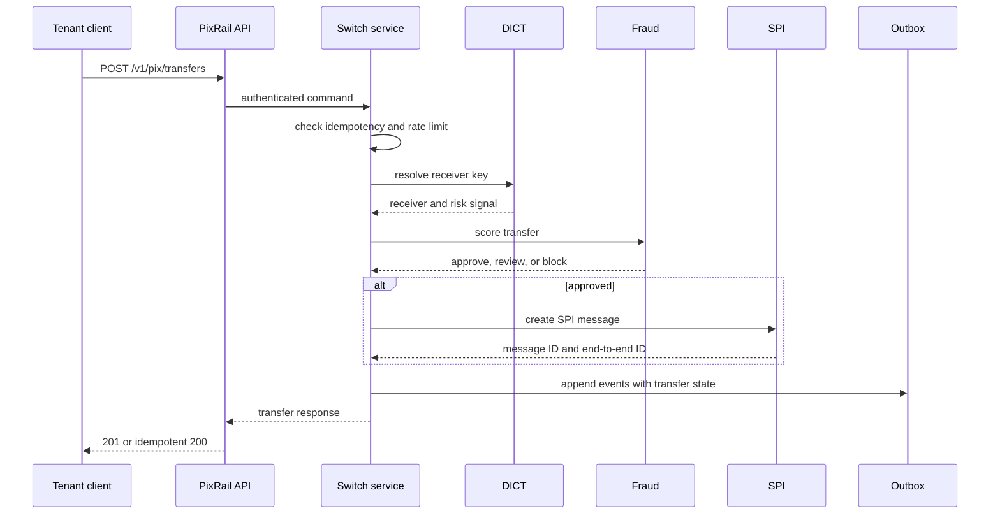

# Transfer Sequence

```mermaid
sequenceDiagram
  participant C as Tenant client
  participant A as PixRail API
  participant S as Switch service
  participant D as DICT
  participant F as Fraud
  participant P as SPI
  participant O as Outbox

  C->>A: POST /v1/pix/transfers
  A->>S: authenticated command
  S->>S: check idempotency and rate limit
  S->>D: resolve receiver key
  D-->>S: receiver and risk signal
  S->>F: score transfer
  F-->>S: approve, review, or block
  alt approved
    S->>P: create SPI message
    P-->>S: message ID and end-to-end ID
  end
  S->>O: append events with transfer state
  S-->>A: transfer response
  A-->>C: 201 or idempotent 200
```
