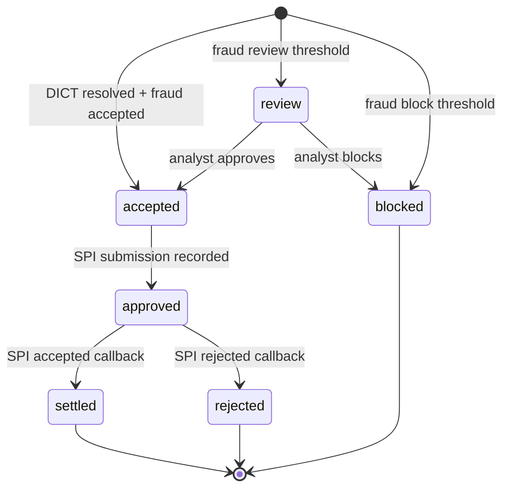

# State Machines

## Transfer state

## Transition rules

- `blocked` is terminal in PixRail.
- `accepted` is durable pre-SPI state; create never calls SPI before persistence.
- `review` requires an explicit manual review decision before SPI submission.
- `approved` has a SPI message ID and end-to-end ID.
- `settled` and `rejected` are terminal.
- Duplicate callbacks with the same callback hash replay the terminal state.
- A callback with a mismatched SPI message ID is a conflict.
- A terminal callback with a different callback hash is a conflict, not a replay.
