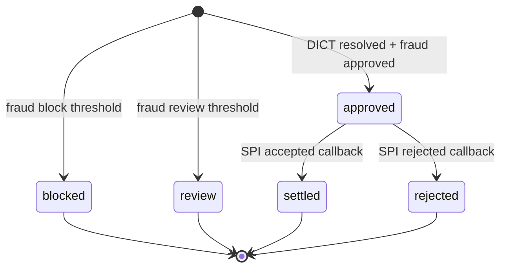

# State Machines

## Transfer state

## Transition rules

- `blocked` is terminal in PixRail.
- `review` does not create a SPI message in the current MVP.
- `settled` and `rejected` are terminal.
- Duplicate callbacks for terminal transfers replay the terminal state.
- A callback with a mismatched SPI message ID is a conflict.
